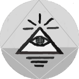

<h1 align="center">Rhymes with Zion</h1>

* [Introduction](#introduction)
   * [Purpose](#purpose)
   * [Who is it for?](#who-is-it-for)
   * [What Rhymes with Zion isn't](#what-rhymes-with-zion-isnt)
* [About ](#about)
   * [Our Ethos](#our-ethos)
   * [Weekly Schedule](#importing-vcards-cli-only)
   * [FAQs](#frequently-asked-questions)
* [Get Involved](#get-involved)
   * [How to get Involved](#how-to-get-involved)
   * [Curate](#curate)
   * [Feedback](#feedback)
   * [Submissions](#submissions)
   * [Posting Template](#posting-template)
   * [Other ways to Support](#statistics)
* [Contact](#contact)
   * [How to get in touch](#how-to-get-in-touch)
   * [Connect accross the web](#connect-accross-the-web)
* [Credits](#credits)
* [License](#license)

## Introduction

If we consider a 'work of art' a creation from the infinite potential of nature into a finite actuality which unveils a cultural worldview (e.g. Ancient Greek culture using stones to represent their myths through statues, or certain Indigenous cultures of North America using trees to create Totem Poles which tell a narrative), then audio-visual creations portrayed through a digital medium is the epitome of a contemporary work of art.

The goal of Rhymes with Zion is to present these audio-visual works of art through a digital medium, think of it like an online art gallery which has been curated by collaborators on the internet. Everything done to create rhymes with zion is done through an internet connection. In other words Rhymes with Zion is built, designed, and managed completely through a web-browser.

### Purpose

Rhymes with zion provides a digital place for the curation of audio-visual works of art. It is a collaborative project which aims to share audio-visual works of art. Every work of art being showcased is shared for the sake of itself, presenting it as intrinsically valuable and not just a means to an end.

### Who is it for?

This website remains as inclusive as possible and tries it's best to be accessible to anyone with access to the internet. Whether you are a passive viewer exploring the web looking for cool and interesting content to surf through, or actively engaged wanting to [get involved](#get-involved)

### What rhymes with zion isn't

Rhymes with Zion is unfortunately not the place to find out what rhymes with zion. Luckily, there are <a href="http://lmgtfy.com/?q=rhymes+with+zion" target="_blank">plenty of websites</a> which provide that service. It also, is not on the front-page of google (as you may have seen if you clicked that link above). 

Rhymes with Zion is not a website for self-promotion. Although it encourages contribution through the [curation](#curate) and [individual submissions](#submissions) of their favourite audio-visual works of art, it is not a place for artists to share their own work. By sharing the work of others, you can indirectly promote yourself through your [contributor's page](http://www.rwz.io/contributors/test). That does not mean the audio-visual works of art created by contributors can't be shared on the site, it just has to be curated by another contributor who did not help create it.

Rhymes with Zion is not commercially driven in any way. It does not have a profit motive, and therefore it is not a place where you will see any form of advertisement or marketing campaigns. There is no space for sponsored content or promotional posts. Every work of art being showcased is shared for the sake of itself, presenting it as intrinsically valuable and not just a means to an end. 

## About

The internet has changed the way we see and connect with the world, others, and ourselves. It has enabled digital media to become a ubiquitous throughout society. Rhymes with zion provides a place within cyberspace which curates audio-visual works of art that provides perspective of different cultural worldviews, connects you with a variety of artists and others, and presents these works of art as an intrinsic value in itself to enable the viewer to reflect on their experience. 

### Our Ethos

Rhymes with Zion strives to provide an environment which embraces inclusivity and being agile in the way it operates. What makes Rhymes with Zion different than other projects, is our embodiment of these three core values that are embedded within the entire philosophy of the project. 

#### Openness

Whether it is open source software or being open to different cultural worldviews through presenting a diverse tapestry of art, rhymes with zion embraces an ethos of openness. All the code is accessible on a public repository and it is made available for others to use with an MIT license. The project does not limit itself to a particular genre or style of audio-visual works of art through the recognition that art opens up a perception of cultural worldviews, and therefore the more variety of art made available on rhymes with zion the better it is for openning oneself up to different ways to see the world. 

#### Collaboration

T

#### Continuous Improvement

We recognize that Rhymes with Zion will never be perfect, and will not necessarily meet the needs of all it’s users all the time but there is always room for improvement. The website has been developed in an agile way, and it [takes the feedback of it’s users](#feedback) to constantly strive to improve the product. 

### Weekly Schedule

The website tries to keep some consistency by posting one audio/visual work of art a day. To find our more, <a href="http://www.rwz.io/weekly-sched/" target="_blank">vist the webpage<a/>.

### Frequently Asked Questions

Lots of questions have been asked and will be asked about the project, and the most frequently asked questions need to be collated and presented on the website. Currently there are not enough questions being repetitively asked, so if you have any questions than  

## Get Involved

Interested in being more than just a passive viewer and want to actively get involved. Great! There are plenty of ways in which you can help contribute to this collaborative and open project.

### How to get involved

This website is built openly and is inclusive to all, enabling many ways for you to get involved. Whether you are an art-lover, creative, developer, or designer, rhymes with zion is an inclusive space for collaboration. The main way to get involved is to contribute, whether it be providing content by becoming a [curator](#curate) or [individual submissions](#submissions). If you are not interested in contributing content, you can still get involved through providing [feedback](#feedback) which will help continuously improve your experience. If generating content or feedback forms are not your thing but you still want to get involved, there are plenty [other ways to support](#other-ways-to-support).

### Curate

This website embraces openness and collaboration, the best way to provide an inclusive environment with diverse works of art being displayed within a digital place is through other people curating it. If you are interested in curating, please follow the instructions on the <a href="https://docs.google.com/document/d/1u7PoI3MD21fb0GxSsZyfxVKJhmEE8eP3cbyBOWyufss" target="_blank">template</a>.

When curating you are free to create your own theme or vibe. You will need to have 7 posts for a week (follow the post template but feel free to get creative). Curators will also have a contributor webpage which requires; a bio writte-up / photo / relevant links - [example page](http://www.rwz.io/contributors/test/).

If you are interested in becoming a contributor and curate rhymes with zion's audio-visual art gallery which dwells in cyberspace but want to know a bit more about it before you begin filling out the <a href="https://docs.google.com/document/d/1u7PoI3MD21fb0GxSsZyfxVKJhmEE8eP3cbyBOWyufss" target="_blank">template</a>, please don't hesitate to email: contact@rwz.io 

### Feedback

We strive for continuous improvement of the website and the ideas behind it.. Whether you think the build, content, design, scope, or just overall user experience of rhymes with zion can be improved, we would love to hear your <a href="http://rwz.io/feedback" target="_blank">feedback</a>. 

### Submissions

There are plenty of days left in 2017 (both backtracking and moving forward) that need a post sharing an audio-visual work of art to fill its empty void. If you have a posting idea than please fill out the <a href="http://www.rwz.io/submissions" target="_blank">submission form</a> on the website. 

### Other ways to support

As mentioned [above](#what-rhymes-with-zion-isnt) rhymes with zion is not commercially driven and there is no profits being earned from the website. That being said, there still is a cost for rhymes with zion to be able to sustain and monetary support enables this sustainability. If you like what we are doing but are not interested in actively getting involved, consider a one-off financial support through [monzo.me](http://bit.ly/2uNi1tj) or [kofi](http://ko-fi.com/rwzion)

If you are not interested in contributing your time or money to the website but still enjoy it, there are plenty of other ways which you can support rhymes with zion:

* Share it with others, tell people how awesome this website is (and if you don't think it is awesome tell us how we can improve)
* [Connect with us across the web](#connect-across-the-web)

## Contact

Rhymes with zion aims to be as open, collaborative, and constantly striving for further improvement as possible. That means, we are always happy to hear from you for any reason, so please do not hestiate to [get in touch](#how-to-get-in-touch) and don't forget to [connect with rhymeswithzion across the interwebs](#connect-across-the-web)

### How to get in touch

If you would like to curate, complete the <a href="https://docs.google.com/document/d/1u7PoI3MD21fb0GxSsZyfxVKJhmEE8eP3cbyBOWyufss" target="_blank">curator's template</a> and send it to <a href="mailto:rhymeswithzion@gmail.com" target="_blank">rhymeswithzion [at] gmail.com</a> with 'Curate' as the subject line. 

Stand-alone submissions - complete the <a href="https://rwz.io/submissions" target="_blank">submission form</a>

Feedback - please fill out the <a href="https://rwz.io/feedback" target="_blank">feedback form</a>

Any other enquiries use the <a href="https://rwz.io/contact" target="_blank">contact form</a> 

### Connect across the web

*  <a href="https://facebook.com/rhymeswithzion" target="_blank">Facebook</a>

*  <a href="https://github.com/rhymeswithzion" target="_blank">Github</a>

*  <a href="https://instagram.com/rhymeswithzion" target="_blank">Instagram</a>

*  <a href="https://soundcloud.com/rhymeswithzion" target="_blank">Soundcloud</a>

*  <a href="https://twitter.com/rhymeswithzion" target="_blank">Twitter</a>

*  <a href="https://github.com/rhymeswithzion" target="_blank">Youtube</a>

## Credits

Thank you to all the great people / products / services that have enabled rhymes with zion to be open, collaborative, and continuously improve. 

There are plenty of platforms to build a website with user-friendly and intuitive interfaces that enable people with little to no coding skills. Many of these platforms have costs for hosting, templates, and content management systems that can add up to become quite expensive for running a website. Although there are completely free platforms, they usually have limitation when in comes to design and features.

That being said, there are free and/or open source options that have been utilized to meet the needs of this website.

Rhymes with Zion is built, designed, and managed completely on a web-browser, the only expenditure was on the domain name. Here are some of the digital products and tools which have enabled rhymes with zion to exist in its current form:

*  <a href="https://github.com/daattali/beautiful-jekyll" target="_blank">Beautiful Jekyll</a> template by <a href="http://deanattali.com" target="_blank">Dean Attali</a> who provides a brilliant <a href="http://deanattali.com" target="_blank">read-me</a> which guides you how to set-up your own website just like this one within seconds.

*  <a href="https://disqus.com/" target="_blank">Disqus</a> provides the commenting feature for posts on the website.

*  <a href="https://formspree.io/" target="_blank">Formspree.io</a> is a great tool for functional HTML forms which has been used for the contact, feedback, and submissions pages on the website

* <a href="https://codepen.io/matmarsiglio/pen/HLIor" target="_blank">Minimalistic Form</a> a simple and beautiful contact form designed by Matheus Marsiglio. It was easily modified for the contact, feedback, and submission pages on the website.  

*  <a href="https://pages.github.com/" target="_blank">Github Pages</a> provides free web-hosting of the wbsite.

* <a href="https://www.google.com/intl/en/about/products/" target="_blank">Google Products</a> 
    *  <a href="https://www.google.com/analytics/" target="_blank">Analytics</a> - has been set-up to collect data about website traffic and audience of the users. 
    *  <a href="https://www.chromium.org/chromium-os" target="_blank">Chrome OS</a> is the operating system which this website was created, the design, deployment, and management of content is all done on a chromebook. It provides the best experience for creating this project, which is produced online completely through a webbrowser.  
    *  <a href="https://gsuite.google.com/together/" target="_blank">G Suite</a> has been extremely useful for the admin side of the calender. Google's office suite which has been integral to the development and maintenance of the website. This includes (but not limited to): Calendar, Drive, Docs, Forms, and of course Gmail.
    *  <a href="https://developers.google.com/custom-search/" target="_blank">Search</a> has been used for the search function on the website. Google custom search enables a search feature in the website powered by unbeatable google algorithms. 
*  <a href="https://jekyllrb.com/" target="_blank">Jekyll</a> static-website generator, enables you to build directly from a github repository. This website is built with Jekyll.

*  <a href="https://ko-fi.com" target="_blank">Kofi</a> is a free tool that allows user to support the website.

* <a href="https://monzo.me/" target="_blank">Monzo.Me</a> is another way to provide monetary support. Monzo is an awesome bank of the future, and they do not have any transaction fees. 

*  <a href="https://namcheap.com/" target="_blank">NameCheap</a> - provided domain name registration at at the most reasonable price. It also provides email forwarding.

* <a href="https://pixlr.com" target="_blank">Pixlr Editor</a> is a web application which the logo was created and images are formated. 

* <a href="http://prose.io" target="_blank">Prose.io</a> Content management system that provides a user-friendly interface for writing in markdown. This read-me document, as well as all the other pages and posts on the website were written and published through github using <a href="http://prose.io" target="_blank">prose</a>.

Of course credit must be given to everyone involved, including but not limited to: those who have and will contribute to the website, those who have and will provide feedback, those who have supported and will support the website, and those who enjoy and use the website. The sustainable growth and longevity of our existence depends on people like you, so thanks. 

## License

Copyright (c) 2017 Rhymes with Zion

Licensed under the [MIT License](https://github.com/rhymeswithzion/rhymeswithzion.github.io/blob/master/LICENSE)
